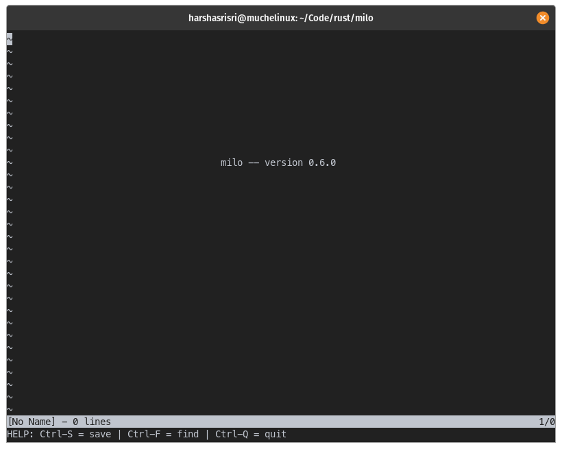

# milo

`milo` was born out of stumbling into [Challenging projects every programmer should try](https://web.eecs.utk.edu/~azh/blog/challengingprojects.html) while carrying an unscratched itch to build something substantial in Rust. 

Fortunately, there is [kilo](https://viewsourcecode.org/snaptoken/kilo/index.html) which gives us a very nice walkthrough, although written in C, covering the design of a rudimentary text editor. This project joins the long list of wannabe text editors written in Rust.

